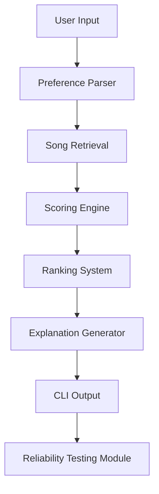

# AI Music Recommender System

## Project Overview
The AI Music Recommender System is an applied AI project built in Python that recommends songs based on a listener's mood, preferred energy level, and optional genre preference.

This system solves a practical recommendation problem: helping users quickly find songs that match their current vibe instead of random popular tracks. This matters because recommendation quality directly affects user trust, engagement, and perceived value of AI-powered products.

Developed as an AI110 final project, this system demonstrates end-to-end applied AI engineering: user input handling, retrieval, scoring, explainability, and reliability testing.

## Original Project Reference (Modules 1-3)
This project builds on the AI110 Modules 1-3 music recommender baseline, where the original system focused on a CLI recommendation loop with dataset loading, basic preference matching, and ranked song output. The original version established the core input -> scoring -> output flow and provided a functional demonstration of rule-based recommendation behavior. This final version extends that baseline with context retrieval, confidence scoring, reliability evaluation, and stronger guardrails.

## Features
- Interactive user preference input for mood, energy, and optional genre
- Candidate retrieval from a song dataset
- Preference-based scoring and ranking logic
- Top 3 recommendation output for concise CLI experience
- Explainable AI output with Why bullet points per recommendation
- Confidence-aware fallback mechanism when recommendation certainty is low
- Built-in reliability testing with predefined test profiles
- Match summary evaluation metric for recommendation alignment
- Graceful handling of invalid input and empty-result paths

AI behavior note: confidence scoring changes system behavior by triggering a baseline ranking fallback when context-aware signals are weak. This keeps the CLI useful instead of returning unstable or empty recommendations.

## System Architecture
```text
User Input
   ↓
Preference Parser
   ↓
Song Retrieval
   ↓
Scoring Engine
   ↓
Ranking System
   ↓
Explanation Generator
   ↓
CLI Output
   ↓
Reliability Testing Module
```



Stage summary:
1. User Input
   Collect user preferences such as mood, genre, and energy.
2. Preference Parser
   Normalize and validate input values so they can be used consistently.
3. Song Retrieval
   Find candidate songs from the dataset that best match user intent.
4. Scoring Engine
   Assign compatibility scores based on preference alignment.
5. Ranking System
   Sort by score and select the top recommendations.
6. Explanation Generator
   Produce concise Why explanations for each recommendation.
7. CLI Output
   Display recommendations in a clean command-line format.
8. Reliability Testing Module
   Run predefined profiles and report match summary performance.

## Sample Interactions
### Interaction 1: Happy + Pop + High Energy
Input:
- mood: happy
- genre: pop
- energy: 0.85
- likes_acoustic: n

Output (top pick):
- Sunrise City - Neon Echo
- Score: 9.96 | Confidence: 0.75
- Why includes mood/genre/energy alignment and retrieved note support.

### Interaction 2: Chill + Lofi + Acoustic
Input:
- mood: chill
- genre: lofi
- energy: 0.40
- likes_acoustic: y

Output (top pick):
- Midnight Coding
- Score: 9.88 | Confidence: 0.74
- Why highlights chill mood fit, acoustic preference alignment, and contextual evidence.

### Interaction 3: Rare Genre Request with Fallback Safety
Input:
- mood: happy
- genre: soca
- energy: 1.00
- likes_acoustic: n

Output behavior:
- System still returns top recommendations instead of failing.
- Confidence is shown for each recommendation.
- If overall confidence is low, baseline ranking fallback is triggered automatically.

## Reliability Testing
The project includes a run_tests() routine to validate recommendation behavior across predefined user profiles.

Test process:
- Run at least 3 predefined test cases (for example: happy, chill, intense)
- Generate top recommendations for each case
- Validate output structure consistency
- Ensure system does not crash
- Compute a simple match summary metric

Match summary metric:
- Reports how many top recommendations match user mood or genre
- Example: 2/3 recommendations matched mood or genre

## Testing Summary (Measured Results)
Automated tests:
- Command: python -m pytest -q
- Result: 4/4 passed
- Coverage highlights: score ordering, explanation output, invalid profile rejection, confidence plus retrieved evidence fields.

Reliability evaluation harness:
- Command: python -m src.evaluate
- Result: 4/4 profile checks passed
- Average confidence: 0.599

What worked:
- Top recommendation matched expected genre families for pop, lofi, and rock-intense profiles.
- System remained stable under adversarial/conflicting preferences and still returned top-5 results.

Surprising or unexpected behavior:
- In the adversarial conflict profile (lofi + intense + very high energy), the system still produced coherent recommendations with non-zero confidence instead of collapsing to empty or random output.
- This highlighted that weighted scoring plus retrieval evidence can stay robust even when user preferences are partially contradictory.

What failed or was weak:
- No hard test failures in the latest run.
- Rare/underspecified input cases can produce lower confidence recommendations.

Improvements made:
- Added low-confidence fallback to baseline ranking.
- Added explicit stage logs: [INPUT], [RETRIEVAL], [SCORING], [OUTPUT].
- Integrated context retrieval into the main user flow.

## Misuse Risks and Prevention
Potential misuse scenarios:
- Over-trusting suggestions as objective truth instead of subjective recommendations.
- Using the recommender as a proxy for mental-health or emotional diagnosis based on mood input.
- Attempting to profile users over time using repeated preference entries.

Concrete prevention and guardrails:
- Scope constraints: the project is explicitly limited to music recommendation and marked as not for high-stakes decisions.
- Input guardrails: invalid profile values are rejected or normalized (for example, energy range checks and profile validation).
- Reliability guardrails: low-confidence outputs trigger fallback behavior to reduce unstable recommendations.
- Transparency guardrails: every recommendation includes Why reasoning and confidence to reduce black-box overtrust.
- Privacy-by-design in current implementation: no user identity fields are required for recommendations.

## Setup Instructions
1. Clone the repository and enter the project folder.
2. Create and activate a virtual environment:
   ```bash
   python3 -m venv .venv
   source .venv/bin/activate
   ```
   After activation, use `python` for the remaining commands.
3. Install dependencies:
   ```bash
   pip install -r requirements.txt
   ```
4. Run the application:
   ```bash
   python -m src.main
   ```
5. Optional validation commands:
   ```bash
   python -m pytest -q
   python -m src.evaluate
   ```

Quick run reference:
```bash
source .venv/bin/activate
python -m src.main
python -m pytest -q
```

## Technologies Used
- Python 3
- Command-Line Interface (CLI)
- CSV-based data pipeline
- Rule-based retrieval and scoring logic
- Explainable recommendation generation
- Pytest for reliability checks

## Design Decisions and Trade-Offs
1. Rule-based scoring over trained ML
- Why: transparent behavior, easier debugging, and predictable outputs for coursework scope.
- Trade-off: less personalization depth than collaborative or embedding-driven models.

2. Retrieval-enhanced context over static explanations
- Why: attach supporting notes so recommendations are evidence-aware.
- Trade-off: retrieval quality depends on note tagging coverage.

3. Confidence scoring with fallback behavior
- Why: expose recommendation certainty and protect user experience on low-confidence outputs.
- Trade-off: fallback may reduce novelty because it reverts to stronger baseline alignment.

4. CLI-first architecture
- Why: minimizes setup complexity and keeps focus on algorithmic quality.
- Trade-off: less approachable UX than a web interface.

## Human Evaluation
Manual walkthroughs were performed using happy/pop, chill/lofi, intense/rock, and conflicting-profile scenarios.

Reviewer observations:
- Explanations are readable and usually aligned with score drivers.
- Confidence values help distinguish strong versus weaker matches.
- Guardrails (input validation and fallback behavior) prevent broken user sessions.

## AI Collaboration Reflection
How AI tools were used:
- Copilot/LLM assistance was used to speed up refactoring, documentation drafting, and edge-case review.

Helpful AI contribution:
- AI suggested integrating context-aware recommendations directly into the main flow and adding stage logs ([INPUT], [RETRIEVAL], [SCORING], [OUTPUT]), which improved traceability and made evaluation output easier to interpret.

Incorrect or misleading AI output:
- An early AI-generated suggestion referenced evaluation profiles before they were defined, which caused a broken import path in evaluation.
- The fix was to define a shared EVALUATION_PROFILES constant in the main module and re-run tests/evaluation to confirm correctness.

## Future Improvements
- Expand dataset size and genre/mood diversity
- Add hybrid recommendation methods (content + collaborative filtering)
- Add embedding-based retrieval for richer semantic matching
- Improve confidence calibration with user feedback
- Add a lightweight web UI (for example, Streamlit)
- Track additional evaluation metrics such as diversity and novelty

## Reflection
Building this project reinforced that practical AI quality comes from system design, not only model complexity. Adding retrieval, confidence scoring, and reliability checks improved trust more than simply adding new features. The main engineering lesson was balancing explainability and robustness: users need both understandable reasons and safe behavior when confidence is low.
This project reflects my ability to design reliable AI systems that handle uncertainty, validate inputs, and produce explainable outputs rather than just generating results.
This project demonstrates my ability to design reliable, explainable, and production-aware AI systems.

## Project Notes
- Architecture diagram source: assets/system_architecture.mmd
- Reflection and ethics documentation: model_card.md
- Add your demo walkthrough link before final submission

## Demo Walkthrough
- Loom Demo: [Watch the Demo](https://www.loom.com/share/3d37d551f9ca4213802e9d1a1aa73988)

Replace the placeholder above with the final Loom walkthrough link before submission.

If video is unavailable, add screenshots or a short GIF to assets and link them here.

## Submission Checklist
- [x] Functional recommender system
- [x] Explainable recommendation output
- [x] Reliability testing with match summary
- [x] Professional README and model card
- [x] Demo link added
- [x] Commit and push to GitHub