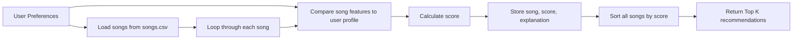

# 🎵 Music Recommender Simulation

## Project Summary

This project builds a small music recommender that uses a content-based approach to match a user's taste profile with songs in a small catalog. Each song is represented by features such as genre, mood, energy, tempo, valence, danceability, and acousticness, and the recommender scores songs based on how closely they match the user's preferences. The final output is a ranked list of songs with short explanations for why each one was recommended.

---

## How The System Works

Real-world platforms such as Spotify or YouTube usually combine multiple signals at scale, including user behavior, listening history, likes, skips, playlists, and content features. My version keeps the system simple by prioritizing a content-based approach, which means it recommends songs by comparing song features directly to a user's preferences instead of using data from other listeners.

This system uses song features and user preferences to estimate which songs are the best fit.

Each `Song` stores the following information:

- title and artist
- genre
- mood
- energy
- tempo in beats per minute
- valence, which roughly reflects how positive the song feels
- danceability
- acousticness

For a simple content-based recommender, the most useful features for defining musical vibe are genre, mood, energy, and acousticness. These features match how people often describe music in everyday language, such as upbeat, chill, intense, or soft. Tempo, valence, and danceability are also useful because they add more detail to the vibe, but they work best as supporting signals rather than the only factors.

The expanded catalog now includes 18 songs with a wider range of genres and moods, including hip-hop, classical, country, electronic, R&B, metal, folk, and latin. This makes it easier to test whether the recommender can meaningfully separate very different vibes instead of only choosing between a few similar songs.

The `UserProfile` stores a smaller set of listener preferences:

- favorite genre
- favorite mood
- target energy level
- whether the user prefers acoustic songs

My example taste profile during design was:

```python
{
   "genre": "lofi",
   "mood": "chill",
   "energy": 0.4,
   "likes_acoustic": False,
}
```

This profile is specific enough to separate chill lofi songs from intense rock or metal songs because it combines both category features and a numerical target. Genre and mood identify the style, while the energy target helps the recommender distinguish low-energy tracks from high-energy ones. For the CLI verification step, the default runnable profile is set to a pop, happy, high-energy listener so the output is easy to compare against expectations.

The recommender gives every song a score. This is the scoring rule: a song earns more points when it matches the user's favorite genre and mood, has an energy level close to the user's target, and fits the user's acoustic preference. Genre is weighted a little more heavily than mood because it is usually a stronger signal of long-term taste, while mood helps refine the recommendation within that style. For numerical features such as energy, the best rule is not to reward bigger or smaller numbers by default, but to reward songs that are closer to the user's preferred value.

### Algorithm Recipe

- `+3.0` points for a genre match
- `+2.5` points for a mood match
- up to `+2.0` points for energy similarity, with more points for songs closer to the target energy
- up to `+1.0` point based on whether the song's acousticness matches the user's acoustic preference

This weighting keeps genre as the strongest signal, lets mood refine the vibe, and uses energy and acousticness to separate songs that might share a genre but feel very different.

After all songs are scored, the list is sorted from highest score to lowest score, and the top `k` songs are returned as recommendations. This is the ranking rule. Both parts are necessary: the scoring rule decides how well one song matches the user, and the ranking rule decides which songs should appear first when many songs are being compared.

### Data Flow



This is a simple content-based recommender because it compares the attributes of songs directly to the user's preferences. It does not use other users' listening history the way a collaborative filtering system would.

One expected bias in this design is that it may over-prioritize genre and miss songs that match the user's mood and energy but come from a different style. It can also under-recommend acoustic tracks for users whose profile is built around genre and mood first, because the system only uses a few weighted features.

### CLI Verification Output

The CLI-first simulation loads the CSV catalog, scores every song, sorts the full list, and prints the top recommendations with the exact reasons used in scoring.

```text
Loaded songs: 18

Top recommendations:

Sunrise City by Neon Echo
   Score: 8.24
   Recommended because genre match (+3.0): pop; mood match (+2.5): happy; energy similarity (+1.92): target 0.80, song 0.82; less-acoustic preference (+0.82): acousticness 0.18.

Gym Hero by Max Pulse
   Score: 5.43
   Recommended because genre match (+3.0): pop; energy similarity (+1.48): target 0.80, song 0.93; less-acoustic preference (+0.95): acousticness 0.05.

Rooftop Lights by Indigo Parade
   Score: 4.99
   Recommended because mood match (+2.5): happy; energy similarity (+1.84): target 0.80, song 0.76; less-acoustic preference (+0.65): acousticness 0.35.
```

I could not generate or embed an actual terminal screenshot from this environment, so I included the verified output as a text block instead.

---

## Getting Started

### Setup

1. Create a virtual environment (optional but recommended):

   ```bash
   python -m venv .venv
   source .venv/bin/activate      # Mac or Linux
   .venv\Scripts\activate         # Windows

2. Install dependencies

```bash
pip install -r requirements.txt
```

3. Run the app:

```bash
python -m src.main
```

### Running Tests

Run the starter tests with:

```bash
pytest
```

You can add more tests in `tests/test_recommender.py`.

---

## Experiments You Tried

I tried the recommender with different user profiles to see how the rankings changed. For a user who likes pop, happy songs, and higher energy music, songs such as "Sunrise City" and "Rooftop Lights" ranked near the top because they matched the target genre, mood, and energy level well.

I also considered how the output would change if the scoring weights were adjusted. Lowering the genre weight would make mood and energy matter more, which could allow songs from different genres to rank higher if they still matched the overall vibe. Adding more weight to acousticness would likely help chill and lofi songs rise for users who prefer softer, more acoustic tracks.

---

## Limitations and Risks

This recommender has several clear limitations. It only works on a tiny catalog of songs, so the recommendations are limited by what is available in the dataset. It also does not understand lyrics, language, artist popularity, or listening context, so it cannot capture many of the reasons real people enjoy music.

The scoring logic is also very simple and may over-favor songs that match one or two strong preferences, especially genre and mood. That can reduce diversity and make the recommendations feel repetitive. In a real system, this kind of design could create bias by repeatedly pushing users toward a narrow slice of the catalog.

---

## Reflection

Read and complete `model_card.md`:

[**Model Card**](model_card.md)

Building this project showed me that recommendation systems turn user preferences and item features into a score, then use that score to rank results. Even a simple model can produce useful recommendations if the features line up well with what the user wants. At the same time, the quality of the recommendations depends heavily on which features are included and how much weight each feature receives.

This project also made it clear that bias and unfairness can appear very easily. If a dataset is small or missing certain genres, moods, or artist styles, the recommender will naturally favor what is already represented. A system like this might also keep recommending the same type of music over and over, which can limit discovery and make the experience less fair for users with more varied tastes.


---

## Model Card

Complete the separate [model_card.md](model_card.md) file to document the intended use, strengths, limitations, and reflection for this recommender in more detail.
---

